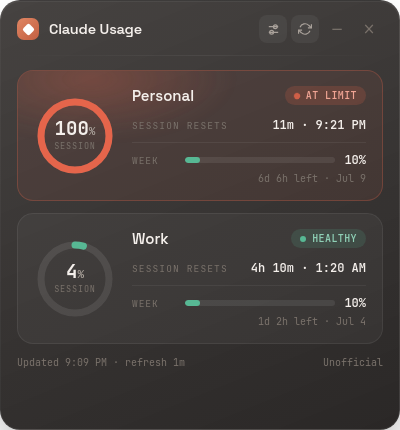

# AI Usage Monitor

A small desktop widget that shows how much of your Claude and ChatGPT usage limits you've used, across several accounts at once.

Unofficial. Not affiliated with Anthropic or OpenAI.



## Download

**[Latest release →](../../releases/latest)**

| Platform | File |
| --- | --- |
| Windows 10/11 x64 | `...-win-Setup.exe` (installer) or `...-win-portable.exe` (no install) |
| Linux x64 / arm64 | `...-linux-*.AppImage` or `...-linux-*.deb` |
| macOS | not released yet — see below |

Every build is **unsigned**, because code signing needs a paid certificate:

- **Windows** — SmartScreen warns on first run: **More info → Run anyway**.
- **Linux** — AppImage needs `chmod +x` first; `.deb` installs with `sudo apt install ./<file>.deb`.

## Platforms

| | Built | Launch-tested | Released |
| --- | --- | --- | --- |
| Windows x64 | yes | yes | yes |
| Linux x64 | yes | yes | yes |
| Linux arm64 | yes | yes | yes |
| macOS arm64 / x64 | yes | partly | **no** |

Every build and launch test runs on a real machine of that architecture in CI —
nothing is cross-built and assumed.

**Why macOS is held back.** On macOS the app asks the system Keychain to store
its encryption key, and macOS shows an "allow access to your Keychain?" prompt.
That is normal, and a signed app gets asked once. Without a Developer ID
signature the prompt can return on every launch, which is a poor enough
experience that shipping it would be worse than not shipping it. Everything else
passes on real Apple Silicon — the full failure-path suite and package
inspection — so this is a signing problem, not a code one.

## What it does

- One card per account — mix Claude and ChatGPT, personal and work
- A row per limit window, with a countdown to reset
- Green to 79%, orange to 94%, red above — everywhere, including the tray
- 7-day usage history graph
- Manual entry, if you'd rather not sign in or automatic reading breaks
- Minimise to tray, always-on-top, dark and light themes

## Honest readings

- A number it can't read shows as `—`, never as a green 0%
- A failed refresh keeps the last good numbers and tags them `stale`, with the time they were actually read
- A temporary failure never deletes your saved sign-in

## Privacy

- Sign-ins are stored locally, encrypted by your OS keychain, and never leave your machine
- If your OS can't protect a credential, the app refuses to save one and offers manual tracking instead
- It talks to `claude.ai` and `chatgpt.com` only, plus GitHub to check for updates
- Removing an account deletes its credential, history and browser data

ChatGPT readings come from an internal, undocumented endpoint on your own logged-in session. OpenAI can change it at any time — that's what manual entry is for.

## Build from source

Requires Node.js 22.12+.

```bash
git clone https://github.com/banuca/ai-usage-monitor.git
cd ai-usage-monitor
npm ci
npm start          # run it
npm test           # unit suites
npm run build:win  # package
```

More detail: [INSTALL.md](INSTALL.md) · [QUICKSTART.md](QUICKSTART.md) · [CONTRIBUTING.md](CONTRIBUTING.md)

## Help

Something wrong? Open a [discussion](../../discussions/categories/support) with your OS, Node version and the full error.

## Credits

A fork of the original Claude Usage Widget. Thanks to [@cwil2072](https://github.com/cwil2072), [@dion-jy](https://github.com/dion-jy), [@goooseman](https://github.com/goooseman) and [@sergkuzn](https://github.com/sergkuzn), whose work this builds on.

ChatGPT support builds on community research into the `backend-api/wham/usage` endpoint — [openai/codex](https://github.com/openai/codex), [opencode-mystatus](https://github.com/vbgate/opencode-mystatus), [OpenTokenUsage](https://github.com/PowerUserZ/OpenTokenUsage).

If it's useful: [buymeacoffee.com/banuca](https://buymeacoffee.com/banuca) ☕

## License

[MIT](LICENSE)
