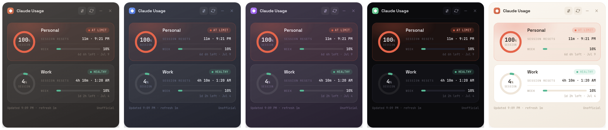
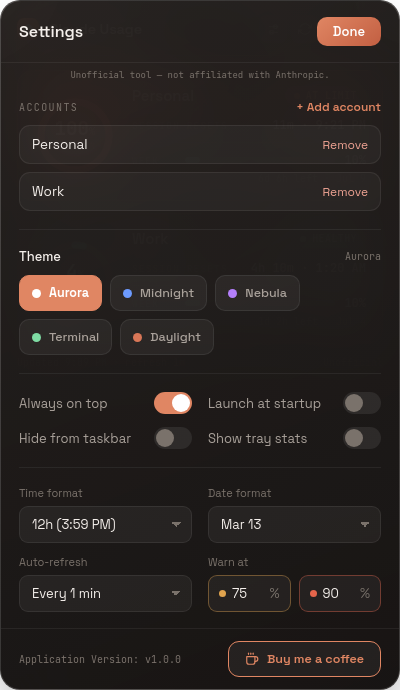

# Claude Usage Widget

A beautiful, standalone desktop widget for **Windows and Linux** that tracks your Claude.ai usage across **multiple accounts** in real time — with a themeable, at-a-glance card for each account.

> **Project notice:** This is a fork maintained at `banuca/multi-account-claude-usage-widget`. It adds multi-account monitoring (e.g. personal + work) and a full themeable redesign on top of the original widget. The original MIT licence and copyright notice are retained.


---

## Features

👥 **Multi-account monitoring** — One labelled card per account (personal, work, and more), each polled independently
🎯 **Circular session gauge** — A ring per account showing session usage %, colored by status
🚦 **Status chips** — Each card shows **Healthy / Warn / At limit** at a glance, with an animated at-limit pulse
📊 **Weekly usage bar** — Weekly limit with remaining time and reset date
🎨 **Five themes, switched live** — Aurora, Midnight, Nebula, Terminal and Daylight — pick one in Settings and it applies instantly, no restart
🔒 **Fixed status colors** — Green/amber/red stay identical in every theme, so the limit signal is always readable; only the neutrals and accent change
🔤 **Crafted typography** — Space Grotesk for the UI, JetBrains Mono for every number and label (both bundled — no network fonts)
🔄 **Auto-refresh** — Configurable interval with an animated refresh indicator
📍 **Always on top** — User-controlled, stays visible across workspaces
💾 **System tray** — Minimize to tray, with an optional per-account usage rollup in the tray tooltip
⚙️ **Settings panel** — Persistent preferences for accounts, theme, startup, tray, thresholds, and date/time formats
🔔 **Update notifications** — Automatic check for new releases on startup
🕐 **Configurable date & time formats** — 12h/24h time and flexible weekly reset date display
🔒 **Secure** — Session keys stored locally in per-account encrypted storage

---

## What's New in v1.0.0

### 🎨 Complete themeable redesign

The widget has been rebuilt around a per-account card:

- A **circular session gauge** (usage % in the center) whose ring color reflects the account's status
- A **status chip** — Healthy, Warn, or At limit — with an animated pulse when an account is maxed out
- A **weekly usage bar** with "time left · reset date"
- New typography: **Space Grotesk** (UI) + **JetBrains Mono** (numbers/labels), both bundled

### 🌈 Five live themes

Choose from **Aurora, Midnight, Nebula, Terminal, and Daylight** in Settings. The choice is saved and applied immediately — no restart.



Status colors (green / amber / red) are **fixed across every theme** on purpose — only the background, surface, and accent change — so a card that's at its limit reads the same whether you're in a dark or light theme.

### 👥 Multi-account

Add as many Claude.ai accounts as you like. Each gets its own card and its own session, polled independently, so you can watch a personal and a work account side by side.

> For full release history, see the [Releases](../../releases) page.

---

## Screenshots

### Settings Panel



Settings options:

- 👥 **Accounts** — Add or remove Claude.ai accounts; rename any card
- 🎨 **Theme** — Aurora / Midnight / Nebula / Terminal / Daylight
- 📌 **Always on top** — Keep the widget above other windows
- ⚙️ **Launch at startup** — Auto-start with login (Windows/macOS)
- 🫥 **Hide from taskbar** — Tray-only mode
- 📊 **Show tray stats** — Per-account usage rollup in the tray
- 🕐 **Time format** — 12h or 24h
- 📅 **Date format** — Controls how the weekly reset date is displayed
- ⏱️ **Auto-refresh** — How often usage is polled
- ⚠️ **Warn at** — Configurable amber (warn) and red (at-limit) thresholds

---

## Installation

### Download Pre-built Release

**Windows:**
1. Download the latest `Claude-Usage-Widget-{version}-win-Setup.exe` (installer) or `Claude-Usage-Widget-{version}-win-portable.exe` (no install needed) from [Releases](../../releases)
2. Run the installer or portable exe
3. Launch "Claude Usage Widget" from the Start Menu (installer) or directly (portable)
4. **To launch at Windows startup (portable only):** Press `Win+R`, type `shell:startup`, and copy the portable `.exe` into that folder. To update, copy the new version in and delete the old one.

**Linux:**
1. Download the latest `Claude-Usage-Widget-{version}-linux-x86_64.AppImage` (Intel/AMD) or `Claude-Usage-Widget-{version}-linux-arm64.AppImage` (ARM) from [Releases](../../releases)
2. Make it executable: `chmod +x Claude-Usage-Widget-*.AppImage`
3. Run it: `./Claude-Usage-Widget-*.AppImage`

> **Note:** AppImage runs without installation on most Linux distributions. On Ubuntu 22.04+, you may need to install a dependency first:
> ```bash
> sudo apt install libfuse2
> ```

#### Linux: Desktop Launcher & Autostart (optional)

By default the AppImage runs from wherever you put it. To get a clickable icon in your app launcher (and optionally launch at login), follow these steps.

**1. Place the AppImage somewhere permanent:**
```bash
mkdir -p ~/.local/bin
mv Claude-Usage-Widget-*.AppImage ~/.local/bin/claude-usage-widget.AppImage
chmod +x ~/.local/bin/claude-usage-widget.AppImage
```

**2. Create a desktop entry:**
```bash
cat > ~/.local/share/applications/claude-usage-widget.desktop << EOF
[Desktop Entry]
Name=Claude Usage Widget
Comment=Monitor Claude.ai usage
Exec=$HOME/.local/bin/claude-usage-widget.AppImage --no-sandbox
Icon=$HOME/.local/bin/claude-usage-widget.AppImage
Terminal=false
Type=Application
Categories=Utility;
StartupNotify=true
EOF
```

> **Note:** The `--no-sandbox` flag is required for Electron-based AppImages on most Linux systems due to sandbox namespace restrictions. This is an Electron/Chrome limitation, not specific to this widget.

**3. Register the entry:**
```bash
update-desktop-database ~/.local/share/applications/
```

The widget should now appear in your application launcher. Test it by launching from your app menu before proceeding to autostart.

**4. Autostart at login (optional):**
```bash
mkdir -p ~/.config/autostart
cp ~/.local/share/applications/claude-usage-widget.desktop ~/.config/autostart/
```

---

### Build from Source

**Prerequisites:**
- Node.js 18+ ([Download](https://nodejs.org))
- npm (comes with Node.js)

```bash
git clone https://github.com/banuca/multi-account-claude-usage-widget.git
cd multi-account-claude-usage-widget
npm install
npm start
```

---

## Usage

### First Launch

1. Launch the widget
2. Click "Add account" when prompted
3. A browser window will open — log in to your Claude.ai account
4. The widget will automatically capture your session
5. Usage data starts displaying immediately

Repeat "Add account" (from Settings) for each additional account you want to track.

### Widget Controls

- **Drag** — Click and drag the title bar to move the widget
- **Settings** — Click the sliders icon to open Settings
- **Refresh** — Click the refresh icon to update data immediately
- **Minimize** — Click the minus icon to hide to system tray / dock
- **Close** — Click the X to close the app

### System Tray

Right-click the tray icon for: Show/Hide, Refresh, per-account details, Settings, and Exit.

---

## Understanding the Display

Each account card shows:

| Element | Description |
|---------|-------------|
| Session gauge | Circular ring + % for the current 5-hour session window |
| Status chip | Healthy / Warn / At limit for the account |
| Session resets | Time remaining · local clock time when the session resets |
| Week bar | Weekly limit usage, with time left · reset date |

**Status colors (identical in every theme):**
- 🟢 Green — Healthy (below the warn threshold, default 75%)
- 🟠 Amber — Warn (at or above the warn threshold)
- 🔴 Red — At limit (at or above the danger threshold, default 90%)

The session ring and status chip use these colors; only the theme's background and accent change between themes.

---

## Privacy & Security

- Session keys stored **locally only**, in per-account encrypted storage
- No data sent to any third-party servers
- Only communicates with the official Claude.ai API
- Removing an account clears its session data, cookies, and Electron session partition

---

## Troubleshooting

**"Session expired" keeps appearing** — That account's session may have expired. Click "Reconnect" on the account card to re-authenticate.

**Widget not updating** — Check your internet connection, click refresh manually, or reconnect the affected account.

**Build errors** — A clean reinstall resolves most issues:
```bash
rm -rf node_modules package-lock.json
npm install
```

If issues persist, open a [Support discussion](../../discussions/categories/support) with your OS, Node.js version, and full error output.

---

## Roadmap

- [x] Linux support
- [x] Settings panel
- [x] Remember window position
- [x] Custom warning thresholds
- [x] Configurable date & time formats
- [x] Update notifications
- [x] Multi-account monitoring
- [x] Themeable redesign (5 themes)
- [x] Organization/Teams support
- [ ] Keyboard shortcuts

---

## Support

If this widget is useful to you, you can support development here:

☕ **[buymeacoffee.com/banuca](https://buymeacoffee.com/banuca)**

---

## Credits

Built as a fork of the original Claude Usage Widget. Thanks to the upstream author and contributors whose work this builds on:

- [@cwil2072](https://github.com/cwil2072) — macOS minimize/restore fix, usage history graph
- [@dion-jy](https://github.com/dion-jy) — Login flow architecture improvements
- [@goooseman](https://github.com/goooseman) — Login window security improvements
- [@sergkuzn](https://github.com/sergkuzn) — Linux desktop launcher & autostart documentation

---

## License

This project is licensed under the [MIT License](LICENSE) — see the LICENSE file for details.

---

*Built with Electron · [Releases](../../releases) · [Discussions](../../discussions)*
